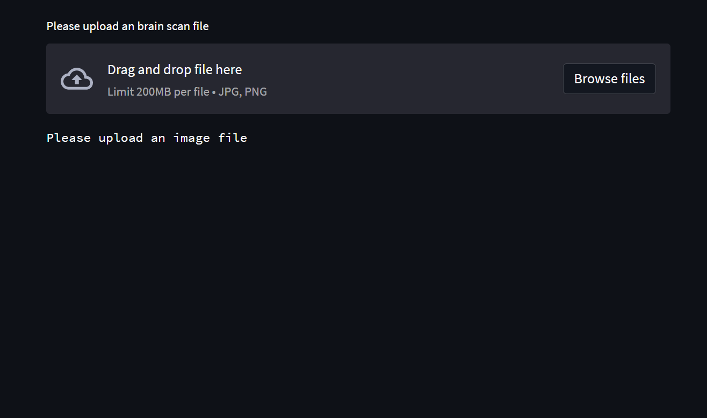
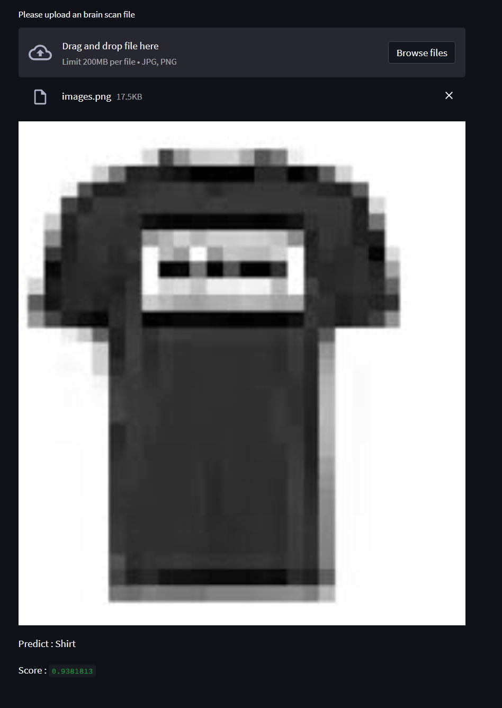

# FashionMNIST
[Fashion-MNIST](https://keras.io/api/datasets/fashion_mnist/) is a dataset of Zalando's article images—consisting of a training set of 60,000 examples and a test set of 10,000
examples. Each example is a 28x28 grayscale image, associated with a label from 10 classes. Zalando intends Fashion-MNIST to serve
as a direct drop-in replacement for the original MNIST dataset for benchmarking machine learning algorithms. It shares the same
image size and structure of training and testing splits.


## Clone recursively
``` shell
git clone https://github.com/yahyoxonqwe/FashionMNIST.git
```
## Enter this file
``` shell
cd FashionMNIST
```
## Install Virtual environment
To use the FashionMNIST dataset, it is recommended to create a virtual environment in Python. You can do this by using the virtualenv package. First, install virtualenv using pip:
``` shell
python -m pip install --user virtualenv
```
## give a name this environment
``` shell
python -m venv your_env
```
## Activate this environment
``` shell
your_env\Scripts\activate.bat
```
## Install requirements
``` shell
pip install -r requirement.txt
```
## Open jupyter notebook
``` shell
jupyter notebook
```
## Run streamlit
``` shell
streamlit run streamlit.py
```


## Predict

